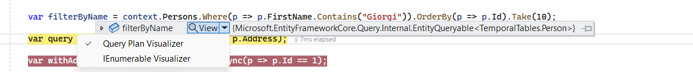
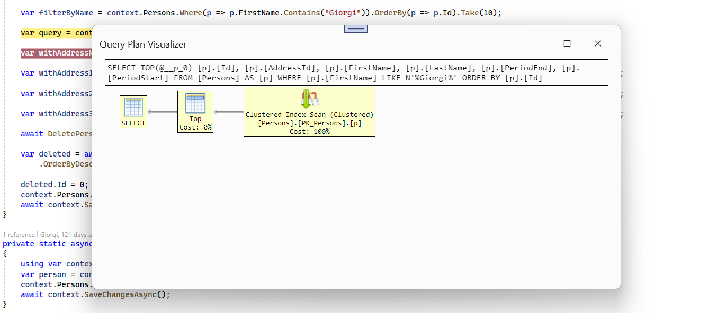
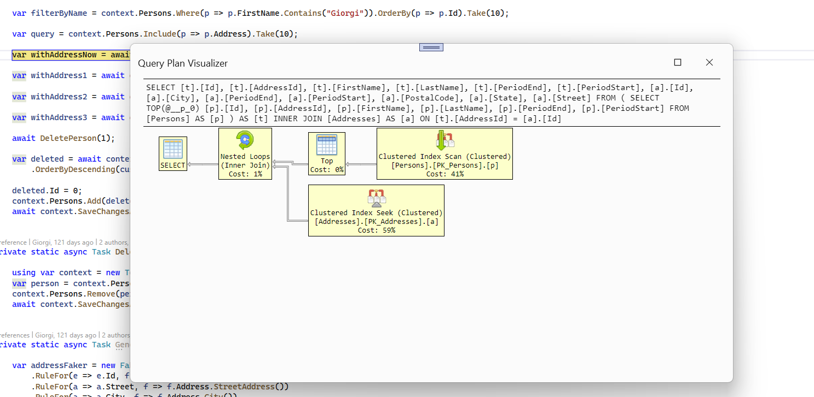
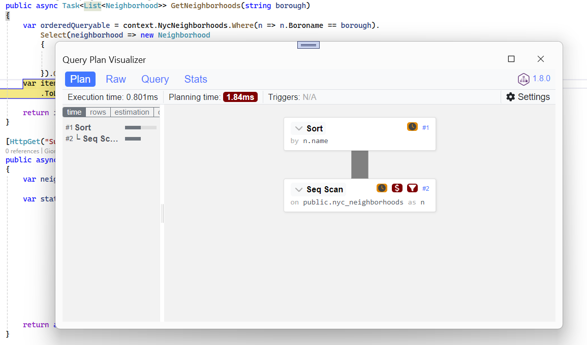
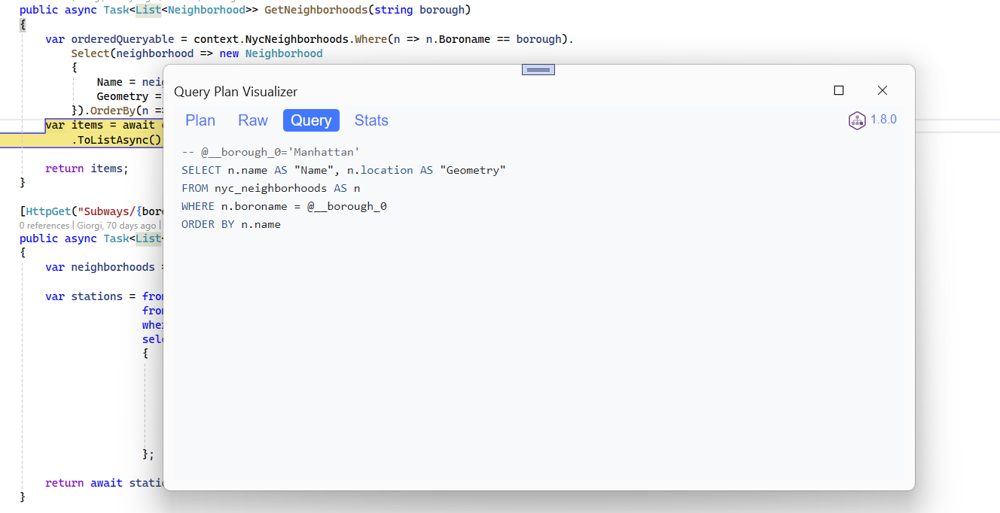

# Entity Framework Core Query Plan Visualizer

View Entity Framework Core query plan directly inside Visual Studio.

## Introduction

With Entity Framework Core query plan debugger visualizer, you can view the query plan of your queries directly inside Visual Studio. Currently, the visualizer supports SQL Server and PostgreSQL.

> [!IMPORTANT] 
> The visualizer requires **Visual Studio Version 17.9.0 (Currently in Preview) or newer** and supports **EF Core 7 or newer**.

## Usage

After installing the [extension from the marketplace](https://marketplace.visualstudio.com/items?itemName=GiorgiDalakishvili.EFCoreVisualizer), a new debugger visualizer will be added to Visual Studio. When debugging, hover over your queries and there will be an option to view the query plan:

Click on 'Query Plan Visualizer' and the query plan will be displayed for your query.

### SQL Server:

### PostgreSQL:

## Credits

This extension uses [pev2](https://github.com/dalibo/pev2/) and [html-query-plan](https://github.com/JustinPealing/html-query-plan) to display query plans.
